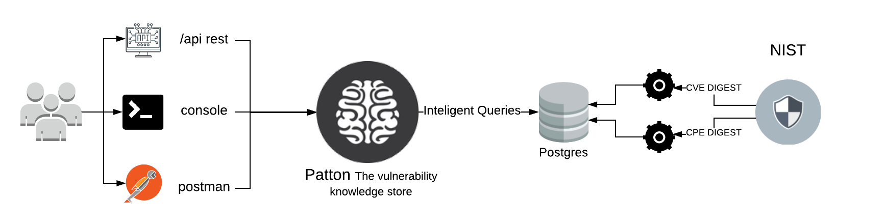

Patton - The vulnerability knowledge store
==========================================

+----------------+-----------------------------------------------+
|Current version | 0.0.3                                         |
+----------------+-----------------------------------------------+
|Project site    | https://github.com/bbva/patton-server         |
+----------------+-----------------------------------------------+
|Issues          | https://github.com/bbva/patton-server/issues/ |
+----------------+-----------------------------------------------+
|Documentation   | https://patton-server.readthedocs.org/        |
+----------------+-----------------------------------------------+
|Python versions | 3.6 or above                                  |
+----------------+-----------------------------------------------+

How it works
============

patton-server is a small service that preprocess CVEs and CPEs from NIST and perform intelligent queries to a postgres database. You can consume the service via api, cli or with the postman in this repository.

What's Patton Server
====================

Patton server is project that store the vulnerability information (CVEs) and link it with product details (CPE) and allow to ask **in a very clever way**.

For example:

Finding library vulnerabilities
-------------------------------

- Given a software library in raw format, i.e: django
- And a version in a possible version, i.e: 1.2

Patton can find all the Product Identification for **Django** and their public vulnerabilities.

Finding software from raw text
------------------------------

- Given a HTTP server banner, i.e: "Apache 2.2-ubuntu2 +PHP Mod"

Patton can find, with a very exact way, vulnerabilities for Apache and the specific version

What's the different with other projects?
=========================================

There're other project, like `CVE Search <https://github.com/cve-search/cve-search>`_ that also stores CVE information. What's is the difference then with Patton?

Clever matching
---------------

Differing with the approach of CVE-Search (and other projects) Patton don't need a CPE as input. Patton **deduces the CPE**.

**The actually Patton purpose is build clever queries** and deduce information. Por example: from a library name and their version, can deduce the related CPEs and associated CVEs.

Be updated
----------

Patton can alert you when new vulnerabilities are released:

You can configure the Patton web-hook and it will alert you with ONLY with new vulnerabilities published.

How to use Patton server?
=========================

Patton serve has a REST API. You can check if in different ways:

- Using raw curl / wget / [YOUR FAVORITE HTTP CLIENT]
- Using the Postman collection you can find in this repo (named patton_server.postman.json)
- **Using Patton-cli (https://github.com/bbva/patton-cli/**: We recommend to use this way. Patton-cli is a powerful client for Patton server that allow to extract and check vulnerabilities for your systems in a many different ways.

Documentation
=============

Go to documentation site: https://patton-server.readthedocs.org/

Contributing
============

Any collaboration is welcome!

There're many tasks to do.You can check the `Issues <https://github.com/bbva/patton-server/issues/>`_ and send us a Pull Request.

Also you can read the `TODO <https://github.com/bbva/patton-server/blob/master/TODO.md>`_ file.

License
=======

This project is distributed under `Apache 2 license <https://github.com/bbva/patton-server/blob/master/LICENSE>`_
