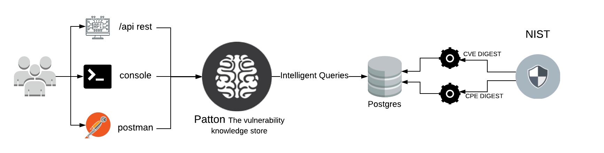

Quick start
===========

This document will give you a brief introduction to Patton Server and how you can use it.

What's Patton Server
--------------------

Patton Server can resolve any library name to their CPE and returns the associated CVEs list for that library.

How it works
++++++++++++

Patton Server is a small service that resolve CVEs and CPEs from NIST and perform intelligent queries to a postgres database. You can consume the service via api, cli or postman, with the collection provided in this repository.

You can see a Demo video for a quick start:

.. image:: http://img.youtube.com/vi/g5pROiIQUzk/0.jpg
   :target: http://www.youtube.com/watch?v=g5pROiIQUzk
   :width: 80 %
   :scale: 50 %
   :alt: Demo
   :align: center

Finding library vulnerabilities
+++++++++++++++++++++++++++++++

- Given a software library in raw format, i.e: django
- And a version, i.e: 1.2

Patton can find all the Product Identification for **Django** and their public vulnerabilities.

How to use Patton server?
+++++++++++++++++++++++++

Patton server exposes a REST API that you can use in different ways:

- Using raw curl / wget / [YOUR FAVORITE HTTP CLIENT]
- Using `Patton-cli <https://github.com/bbva/patton-cli/>`_: We recommend to use this way. Patton-cli is a powerful client for Patton-server that allows you to extract and check for vulnerabilities in your systems in a many different ways.
- Using the `Postman collection <https://github.com/BBVA/patton-server/blob/master/Patton.postman_collection.json>`_. **Postman 2.1 is needed to open collection**.

Example using curl:

.. code-block:: console

    > curl -X POST -d '{"source": "auto", "libraries" : [{"library": "Microsoft IIS","version": "7"}]' --header "Content-Type: application/json" http://my-patton-service.com

What's the different with other projects?
-----------------------------------------

There're other projects, like `CVE Search <https://github.com/cve-search/cve-search>`_ that also allows you to store and search for CVE information. What's the difference then with Patton?

Clever matching
+++++++++++++++

Unlike CVE-Search (and other projects) Patton doesn't need a CPE as input. Patton is able **deduces the CPE**.

**Patton's purpose is to allow you to use simpler and clever queries** deducing from them the information needed to make the search. For example: from a library name and its version, patton-server can deduce the related CPEs and, from them, recover the associated CVEs.

Be updated
----------

Patton can alert you when new vulnerabilities are released:

You can configure the Patton web-hook so it will alert you with ONLY when new vulnerabilities are published.
